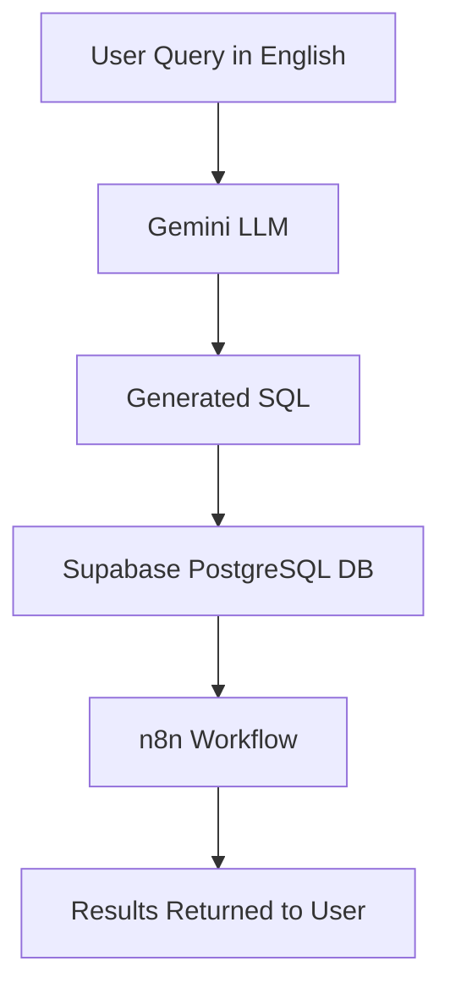

# 🚀 AI-Powered SQL Agent with Workflow Automation  

 
   
  &nbsp;&nbsp;
   
  &nbsp;&nbsp;&nbsp;
   
  &nbsp;&nbsp;&nbsp;
  

---

## ❌ The Problem
In most companies, business users need analysts or developers to fetch even the simplest data.  
This creates a bottleneck:
- Managers waste time waiting for routine reports  
- Analysts spend hours writing repetitive SQL queries  
- Non-technical users feel blocked by technical barriers  

---

## ✅ The Solution
This project removes that bottleneck.  
An **AI-powered SQL Agent** allows users to ask questions in **plain English**.  
The agent automatically:
1. Translates the question into a SQL query  
2. Validates the query against available tables  
3. Executes safely  
4. Returns accurate results instantly  

⚡ Result → Business users get answers faster, analysts focus on real insights, and teams move quicker.  

---

## 🎥 Demo Workflow  

👉 [Watch Demo Video](./demo/demo_workflow.mp4)

---

## ⚠️ Error & Validation Handling
The SQL Agent **never generates random results**. It strictly validates queries:  

- ❌ **Wrong data** → Returns a clear error message.  
- ✅ **Correct data** → Executes safely and shows results.  

👉 [Watch Error Handling Demo](./demo/error_validation.mp4)

---

## 💼 Why It’s Important for Business
- ⏳ **Saves analyst time** by automating repetitive SQL queries.  
- 👩‍💻 **Reduces dependency** on technical staff for simple reports.  
- ⚡ **Improves decision-making speed** with instant query results.  
- 🛡️ **Prevents human errors** in manual SQL writing.  

---

## 🔮 Extended Ways / Future Scope
- ✅ Integrate with **BI dashboards** (Power BI / Tableau).  
- ✅ Add **role-based access control** for query execution.  
- ✅ Implement **query optimization checks** for efficiency.  
- ✅ Support **multiple databases** beyond PostgreSQL.  
- ✅ Deploy as a **Slack/Teams chatbot** for non-technical users.  

---

🚀 This project demonstrates how AI can simplify SQL workflows and empower businesses.  
📩 For collaboration or inquiries, reach out anytime!

